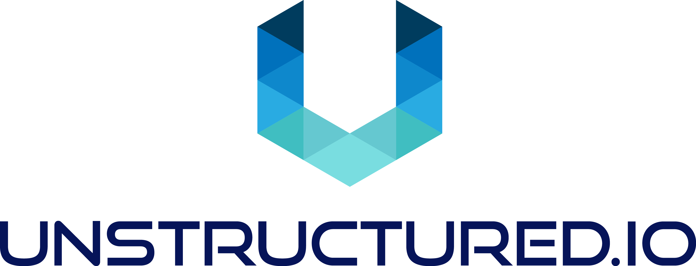

<h3 align="center">
  
</h3>

<div align="center">

  <a href=""></a>
  <a href=""></a>
  <a href=""></a>
  
</div>

<h3 align="center">
  <p>Pre-Processing Pipeline for Receipts</p>
</h3>


This repo implements a document pre-processing pipeline for receipts. Currently, the pipeline is under development. The pipeline assumes the receipts are in PDF or image formats (JPG, PNG).

The API is hosted at `https://api.unstructured.io`.

## :coffee: Getting Started 

* Using `pyenv` to manage virtualenv's is recommended
    * Mac install instructions:
        * `brew install pyenv-virtualenv`
        * `pyenv install 3.8.15`
    
    Create a virtualenv to work in and activate it, e.g. for one named `receipts`:
    
    `pyenv  virtualenv 3.8.15 receipts` <br />
    `pyenv activate receipts`

* Run `make install` 
* Start a local jupyter notebook server with `make run-jupyter` <br />
    **OR** <br />
    just start the fast-API locally with `make run-web-app`
    
#### Extracting Structured Text from an Receipt Image
After API starts, you can extract the elements of Receipt files with the command:
```
curl -X 'POST' \
  'http://localhost:8000/receipts/v0.1.0/receipts' \
  -F 'files=@<your_receipt_file>' \
  | jq -C . | less -R
```

### Generating Python files from the pipeline notebooks

You can generate the FastAPI APIs from your pipeline notebooks by running `make generate-api`.

## :guardsman: Security Policy

See our [security policy](https://github.com/Unstructured-IO/pipeline-receipts/security/policy) for
information on how to report security vulnerabilities.

## 🤗 Hugging Face

[Hugging Face Spaces](https://huggingface.co/spaces) offer a simple way to host ML demo apps, models and datasets directly on our organization’s profile. This allows us to showcase our projects and work collaboratively with other people in the ML ecosystem. Visit our space [here](https://huggingface.co/unstructuredio)!

## Learn more

| Section | Description |
|-|-|
| [Company Website](https://unstructured.io) | Unstructured.io product and company info |
| [Fine-tuned Models and Data](https://huggingface.co/naver-clova-ix) | CORD Consolidated Receipt dataset and Donut model |
